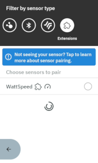
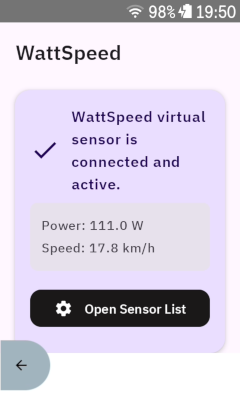

# Karoo WattSpeed Extension

Simple karoo extension that provides speed values based on power when riding indoors.

Compatible with Karoo 2 and Karoo 3 devices.

## What problem does this solve?

When riding on a smart trainer indoors, the Karoo will report the speed values provided by the trainer.
However, most trainers report speed readings based on flywheel speed, which can be way off depending
on your gearing. This extension provides speed values based on your power output instead, as is
done by indoor cycling apps like Zwift. Speed values and traveled distance will thus be more similar
to what you would get when riding outdoors in ideal conditions.

## Installation

If you are using a Karoo 3, you can use [Hammerhead's sideloading procedure](https://support.hammerhead.io/hc/en-us/articles/31576497036827-Companion-App-Sideloading) to install the app:

1. Using the browser on your phone, long-press [this download link](https://github.com/timklge/karoo-wattpad/releases/latest/download/app-release.apk) and share it with the Hammerhead Companion app.
2. Your karoo should show an info screen about the app now. Press "Install".
3. Set up your data fields as desired.

If you are using a Karoo 2, you can use manual sideloading:

1. Download the apk from the [releases page](https://github.com/timklge/karoo-wattpad/releases) (or build it from source)
2. Set up your Karoo for sideloading. DC Rainmaker has a great [step-by-step guide](https://www.dcrainmaker.com/2021/02/how-to-sideload-android-apps-on-your-hammerhead-karoo-1-karoo-2.html).
3. Install the app by running `adb install app-release.apk`.
4. Set up your data fields as desired.

## Usage

After installation, add the "WattSpeed" virtual speedometer as a sensor. It will then provide
speed values based on your power output during riding.

Opening the app will show a screen with some information about the current status.

## Credits

- Icon is `speedometer` by [boxicons.com](https://boxicons.com) (MIT-licensed).

## Links

[karoo-ext source](https://github.com/hammerheadnav/karoo-ext)
